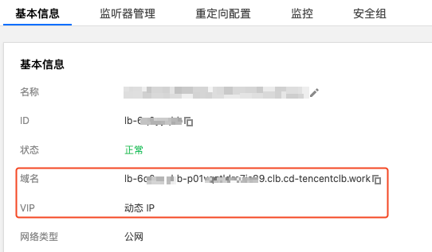

# 使用 CLB 为 Pod 分配公网地址映射

## 创建 DedicatedCLBService

通过自动为 CLB 创建监听器并绑定单个 Pod 来实现为 Pod 分配独立的公网地址：

```yaml
apiVersion: networking.cloud.tencent.com/v1alpha1
kind: DedicatedCLBService
metadata:
  namespace: demo
  name: gameserver
spec:
  lbRegion: ap-chengdu # 可选，CLB 所在地域，默认为集群所在地域
  minPort: 501 # 在 CLB 自动创建监听器，每个 Pod 占用一个端口，端口号范围在 501-600
  maxPort: 600
  selector:
    app: gameserver
  ports:
  - protocol: UDP # 端口监听的协议（TCP/UDP）
    targetPort: 9000 # 容器监听的端口 (游戏战斗服、会议等进程监听的端口)
    addressPodAnnotation: networking.cloud.tencent.com/external-address # 可选，将外部地址自动注入到指定的 pod annotation 中
  existedLbIds: # 如果复用已有的 CLB 实例，指定 CLB 实例 ID 的列表
    - lb-xxx
    - lb-yyy
    - lb-zzz
```

## 将外部地址注入到 Pod 的注解中

部署游戏服、会议等应用时，利用 Kubernetes 的 [Downward API](https://kubernetes.io/zh-cn/docs/tasks/inject-data-application/environment-variable-expose-pod-information/) 能力将记录 Pod 外部地址的注解内容挂载到容器内：

```yaml
    spec:
      containers:
        - ...
          volumeMounts:
            - name: podinfo
              mountPath: /etc/podinfo
      volumes:
        - name: podinfo
          downwardAPI:
            items:
              - path: "address"
                fieldRef:
                  fieldPath: metadata.annotations['networking.cloud.tencent.com/external-address']
```

进程启动时可轮询指定文件（本例中文件路径为 `/etc/podinfo/address`），当文件内容为空说明此时 Pod 还未绑定到 CLB，当读取到内容时说明已经绑定成功，其内容为 Pod 的 CLB 外部映射地址，进程可拿到该地址做进一步处理，如游戏战斗服上报自身房间的外部地址给大厅服或匹配服。

文件或注解的内容格式有以下两种形式：
1. `IP:Port`: CLB 的 VIP 加对外的端口号，如 `1.1.1.1:567`，非域名化的 CLB 会使用该形式。
2. `Domain:Port`，CLB 的域名加对外的端口号，如 `lb-6q0yyqhb-p01vqztldre7is89.clb.cd-tencentclb.work:567`，域名化的 CLB 会使用该形式。

通常新创建的 CLB 一般是域名化的 CLB（参考[此公告](https://cloud.tencent.com/document/product/214/86947)），即 CLB 没有固定的 VIP，它的外部地址就是一个域名，VIP 根据域名动态解析出来。

如何确定 CLB 是域名化还是非域名化呢？在 CLB 实例的详情页就可以看出来：



## 注意事项

CLB 有一些[默认的限制](https://cloud.tencent.com/document/product/214/6187)，其中每个 CLB 的监听器数量限制为 50，即最多创建 50 个端口。这个限制只是个软性限制，如有需要，也可以通过 [提工单](https://console.cloud.tencent.com/workorder/category) 来调大。

配置 `DedicatedCLBService` 时，注意 `minPort` 和 `maxPort` 的范围，避免超出限制，也根据实际需要来选择合适的端口区间，比如单个 Pod 如果承载流量很大，端口范围可缩小点，限制绑定的 Pod 数量，避免单个 CLB 流量过大超出带宽上限；反之如果流量小，可扩大端口范围来绑定更多 Pod。
